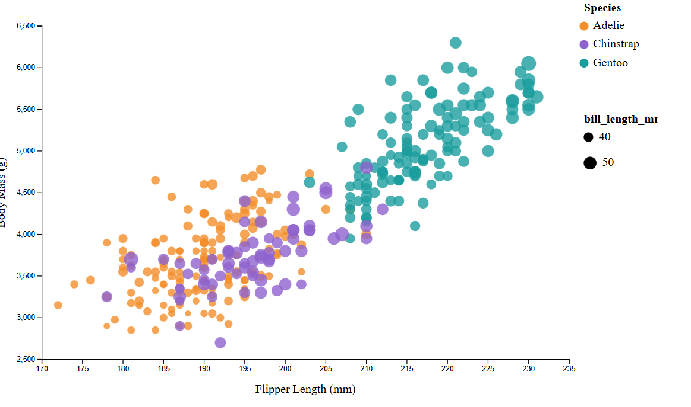
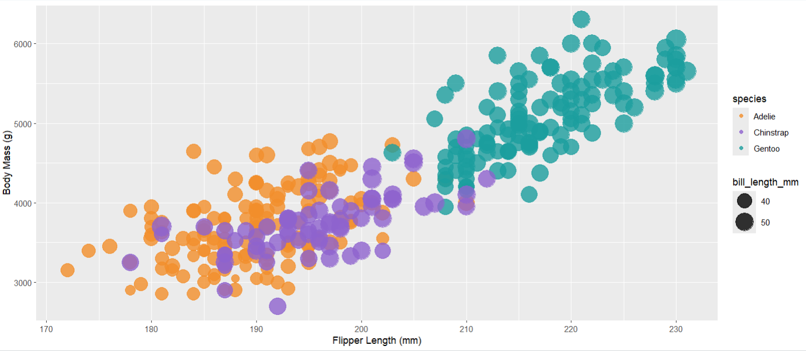
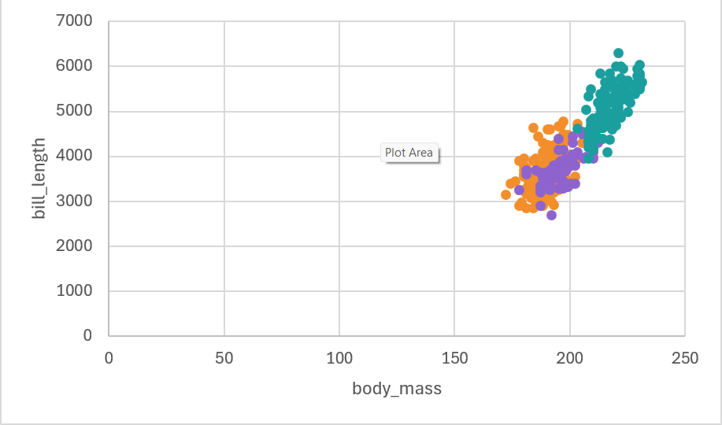
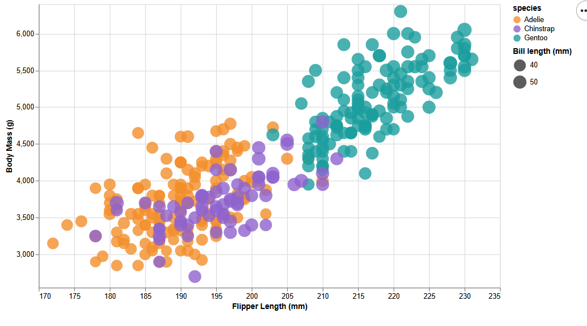
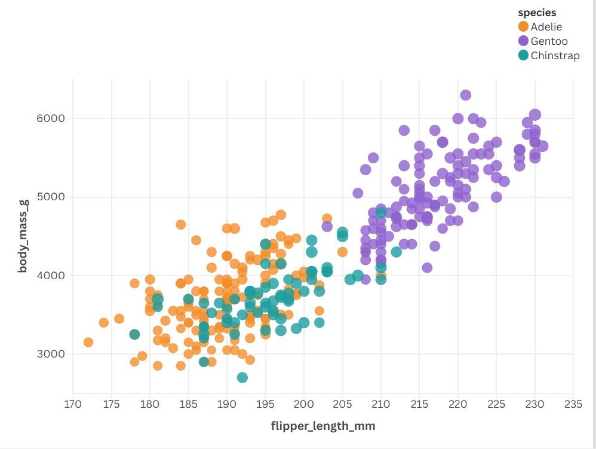

*NOTE: THE BELOW IS A SAMPLE ENTRY TO GET YOU STARTED ON YOUR README. YOU MAY DELETE THE ABOVE.**

# R + ggplot2 + R Markdown

R is a language primarily focused on statistical computing.
ggplot2 is a popular library for charting in R.
R Markdown is a document format that compiles to HTML or PDF and allows you to include the output of R code directly in the document.

To visualized the cars dataset, I made use of ggplot2's `geom_point()` layer, with aesthetics functions for the color and size.

While it takes time to find the correct documentation, these functions made the effort creating this chart minimal.

1. d3 was the first tool I used. I am quite used to D3 now, due to the last project and also my MQP work sometimes requires it. Overall, I think D3 is a great tool, but for a simple graph like this, I don't believe it's the best option. I think the granularity of the tool is great for super complicated stuff, but writing .attr("x"...) over and over proves the syntax can be redundant. 

2. R was the second tool I used. I struggled with this one, as I was attempting to run R in VSCode, but was having issues, and ultimately, never resolved them. I gave up, and decided to move to RStudio. After some installations, I was able to get an environment up and running. I did not like using RStudio however, as it felt clunky and not as user-friendly as VSCode. I did use AI here, as it was my first time working with R. AI helped me debug and with basic syntax questions.

3. I honestly thought Excel would be the best tool for this at the start of this assignment. Now however, I am a firm believer that it might be one of the worst. My excel kept freezing, and even crashed on me once anytime I attempted to zoom in on the chart. It also prevented me from editing it, it took almost 5 minutes just to get the axis labels on it. Additionally, I was unable to get a legend on the graph without Excel freezing to the point of being unusable. This concerns me, as I KNOW other people around the world use excel for datasets way larger than the penglings file. Not sure why this happened, maybe it is just my computer. 

4. Next I chose to use Altair. I've never even heard of this tool, and kinda just picked it randomly. I'm really glad I did actually, as I found this tool incredibly useful, and probably my favorite tool from this assignment. I think the way that the code integrates with the csv is very easy to understand. The syntax is simple, like python typically is, which I really like. I will most likely use this tool again if I get the opportunity. 

5. Finally, we have Flourish. Flourish is honestly a really cool tool, and in my opinion blows Excel out of the water. Flourish allows the ability to import the csv file and immediately have things sorted into a graph where columns are each assigned a letter. You then input these letters to determine axis titles, size, name, legend, etc. This tool is very unique, and I wonder if it will become more popular. 

